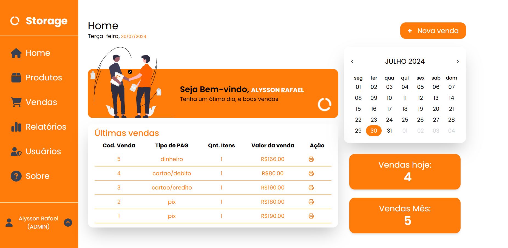

[PROJECT__BADGE]: https://img.shields.io/badge/📱Visit_this_project-000?style=for-the-badge&logo=project
[PROJECT__URL]: https://storage-frontend-eight.vercel.app/

<p align="center">
  
</p>

# Storage

O **Storage** é uma aplicação web completa projetada para oferecer uma experiência robusta e segura de controle de estoque e vendas de produtos diversos. Desenvolvida com tecnologias modernas, esta aplicação visa proporcionar não apenas funcionalidades essenciais de cadastro de produtos e controle de vendas, mas também um ambiente seguro e escalável para gerenciamento de acesso e recursos a páginas protegidas.

[![project][PROJECT__BADGE]][PROJECT__URL]

## Tecnologias

[](https://skillicons.dev)

## Motivação, Desafios e Lições Aprendidas

### A Motivação 💪

O projeto Storage foi criado com o objetivo de desenvolver uma solução full-stack abrangente que me permita praticar e aprimorar minhas habilidades em todas as etapas do desenvolvimento de software. Desde a prototipagem inicial no Figma até a implementação da API e o desenvolvimento do frontend, o Storage visa proporcionar uma experiência completa e integrada.

Minha motivação para este projeto vem do desejo de dominar todas as facetas do desenvolvimento web, garantindo que eu possa criar aplicações robustas e eficientes. E desenvolver um conhecimento consolidado para o futuro.

### Os Desafios 🚀

Meus principais desafios ao desenvolver o projeto Storage foram a implementação do cadastro de produtos no carrinho e a criação dos relatórios. O processo de adicionar produtos ao carrinho exigiu a manipulação cuidadosa do estado para garantir que itens iguais fossem somados corretamente e que a experiência do usuário fosse intuitiva e eficiente. Já a criação dos relatórios demandou a integração precisa dos dados do banco de dados, a fim de gerar informações precisas e úteis, além de garantir que os relatórios fossem acessíveis e formatados adequadamente para as necessidades dos administradores.

### Lições Aprendidas 🌟

- **React**: Aprofundei meus conhecimentos em React, criando componentes reutilizáveis, gerenciando estados locais e lidando com eventos. Explorei técnicas de gerenciamento de estado, como o uso de useState, useEffect, e useNavigate, além de implementar boas práticas de organização de código, como a separação de páginas para usuários e administradores.

- **JWT** (JSON Web Tokens): Avancei meus conhecimentos em segurança e autenticação ao aprender sobre JWT. Compreendi como JWT pode ser utilizado para autenticar usuários de forma segura e eficiente em aplicações web, garantindo a integridade e a confidencialidade das informações transmitidas entre as partes.

- **Prisma**: Aprofundei meu conhecimento no ORM Prisma, utilizando-o para simplificar e agilizar a interação com o banco de dados. Aprendi a seguir boas práticas de organização de código, modularizando funcionalidades e mantendo um código limpo e legível.

- **Integração** Fullstack: Integrar o back-end (com Prisma) e o front-end (com React) me proporcionou uma visão completa do desenvolvimento de aplicativos. Compreendi como as partes se comunicam por meio de APIs REST, garantindo uma integração eficiente e fluida entre os componentes da aplicação.

- **Ferramentas** de Relatórios: Aprendi a utilizar ferramentas como PDF generation e Excel para gerar relatórios. Isso incluiu a criação de relatórios detalhados e formatados adequadamente para atender às necessidades dos administradores, facilitando a análise e a tomada de decisões com base em dados precisos.

- **Boas Práticas**: Aprendi a seguir boas práticas de organização de código, como dividir componentes, modularizar funcionalidades e manter um código limpo e legível. A separação de páginas para diferentes tipos de usuários, como usuários regulares e administradores, foi uma parte essencial dessa organização.

## Primeiros passos

Para começar a desenvolver este projeto, siga as instruções detalhadas nos READMEs das pastas específicas:

1. **Clonar o Repositório**:
   ```bash
   git clone https://github.com/alyssonrafael/Storage
   ```
2. **Leia os READMEs:**

   - [Instruções para o Back-end](./backend/README.md)
   - [Instruções para o Front-end](./frontend/README.md)

## Licença

Este software está disponível sob as seguintes licenças:

- [MIT](https://rem.mit-license.org)

<h2 id="colab">✒️ Agradecimentos</h2>

<table style="border-collapse: collapse; width: 100%;">
  <tr>
    <td style="padding: 20px; border: 1px solid #ccc; text-align: center;">
      <a href="https://github.com/alyssonrafael" style="text-decoration: none;">
        <br>
        <b>Alysson Rafael</b>
      </a>
    </td>
    <td style="padding: 20px; border: 1px solid #ccc;">
Gostaria de expressar minha mais profunda gratidão a todos que contribuíram para este projeto. Cada sugestão, correção de bug e palavra de incentivo teve um impacto enorme. Sua ajuda não só melhorou o projeto, mas também me motivou a continuar. 🚀 Obrigado por estarem ao meu lado nessa jornada!
    </td>
  </tr>
</table>
