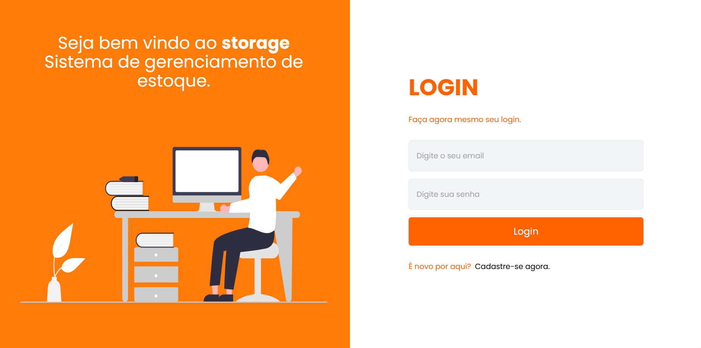
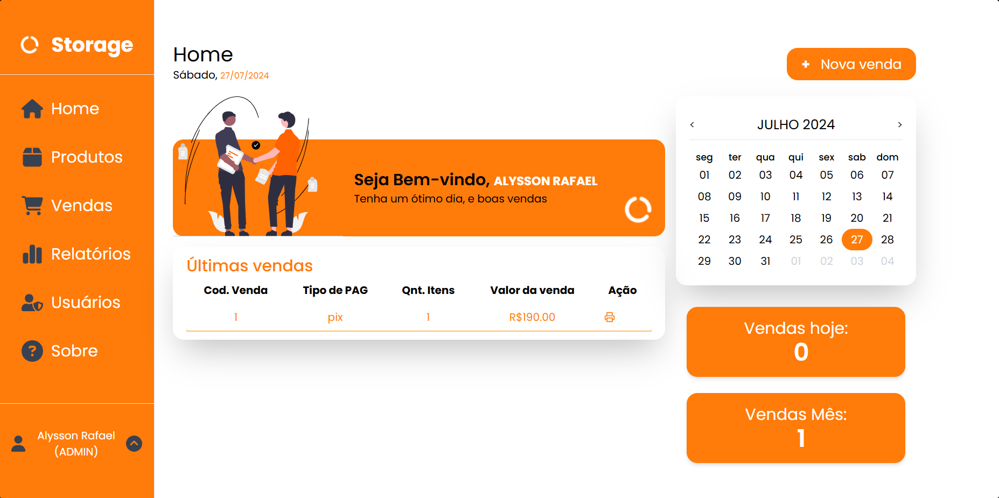

[PROJECT__BADGE]: https://img.shields.io/badge/📱Visit_this_project-000?style=for-the-badge&logo=project
[PROJECT__URL]: https://storage-frontend-eight.vercel.app

<h1 align="center" style="font-weight: bold;">Página de autenticação  * front-end * 🖥️</h1>

<p align="center">
  
  
  
  
  
</p>

<p align="center">
 <a href="#about">Sobre</a> • 
 <a href="#started">Primeiros Passos</a> • 
  <a href="#started">App Routes</a> • 
  <a href="#colab">Autor</a> •
</p>

# Meu Projeto

## Visão Geral

Este projeto é uma aplicação web front-end desenvolvida para fornecer um sistema completo de vendas e controle de estoque. Com esta aplicação, é possível manter um controle preciso sobre o estoque e as vendas, além de gerar relatórios detalhados e visualizar informações gerais através de gráficos interativos.

[](./public/imgLogin.png)

_Tela de Login: Clique na imagem para visualizar em tamanho maior._

[](./public/imgHome.png)

_Tela de Home: Clique na imagem para visualizar em tamanho maior._

<h2 id="started">📌 Sobre</h2>

O front-end deste projeto foi desenvolvido utilizando tecnologias modernas para proporcionar uma experiência de usuário eficiente e agradável. Utilizei o Vite, React como biblioteca JavaScript, TypeScript para tipagem estática, Tailwind CSS para facilitar o desenvolvimento e estilização dos componentes. Além disso, o design foi prototipado no Figma para garantir uma interface visualmente atraente e funcional. Por fim, o deploy foi realizado na plataforma Vercel para disponibilizar o aplicativo de forma rápida e segura na web. 
[Informaçoes adicionais do projeto](./Storage%20ppt%20Front.pdf)


[![project][PROJECT__BADGE]][PROJECT__URL]

<h2 id="started">🚀 Primeiros Passos</h2>

Nesta etapa, vou descrever como você pode executar o front-end localmente em seu ambiente de desenvolvimento.

<h3>Pré-requisitos</h3>

- [Node.js](https://nodejs.org/) - Certifique-se de ter o Node.js instalado.
- [Git](https://git-scm.com/) - Você também precisa do Git instalado em seu sistema.

<h3>Clonagem do Repositório</h3>

Para começar, clone este repositório executando o seguinte comando no terminal:

```bash
git clone https://github.com/alyssonrafael/Storage
```

<h3>Navegando para o Front-end:</h3>
Depois de clonar o repositório, navegue até o diretório do front-end com o seguinte comando:

```bash
cd ./Storage/frontend
```

<h3>Instalando as dependencias</h3>
Certifique-se de instalar todas as dependências necessárias para o front-end. Você pode fazer isso executando:

```bash
npm install
```

<h3>Substituindo Endpoints</h3>

É de extrema importância que você substitua os endpoints pelo URL da sua API. Por exemplo:

```yaml
http://localhost:3333...
```

Isso deverá ser feito em todas as partes do código que fazem requisições para a API. Aproveite esta oportunidade para explorar o código! **_O end-point devera ser substituido no arquivo .env.example e o nome desse aquivo deve ser alterado para
.env.development_**

<h3>Iniciando o front-end</h3>

```bash
npm run dev
```

<h2 id="routes">📍 Application Routes</h2>

Rotas da minha aplicação
​
| Rota | Descrição |
|--------------------------|------------------------------------------------------------------------|
| <kbd>/</kbd> | Página inicial com a tela de login totalmente responsiva|
| <kbd>/register</kbd> |Página de registro|
| <kbd>/homr</kbd> | Página de início com algumas informações e últimas vendas|
| <kbd>/products</kbd> | Página de gerenciamento de produtos e categorias|
| <kbd>/sales</kbd> | Página de vendas com a tabela de todas as vendas realizadas |
| <kbd>/reports</kbd> | Página de relatórios disponível apenas para administradores|
| <kbd>/reguserManagementister</kbd> | Página de gerenciamento de usuários disponível apenas para administradores |
| <kbd>/about</kbd> | Página de Sobre com algumas informações do projeto |
| <kbd>/accountediting</kbd> | Página com a possibilidade de edição de dados do usuário |

<h2 id="colab">✒️ Autor</h2>

<table style="border-collapse: collapse; width: 100%;">
  <tr>
    <td style="padding: 20px; border: 1px solid #ccc; text-align: center;">
      <a href="https://github.com/alyssonrafael" style="text-decoration: none;">
        <br>
        <b>Alysson Rafael</b>
      </a>
    </td>
    <td style="padding: 20px; border: 1px solid #ccc;">
      Gostaria de expressar minha sincera gratidão a todos que contribuíram para este projeto! Seja com sugestões, correções de bugs ou simplesmente com palavras de incentivo, cada um de vocês fez a diferença. 🚀 Obrigado pelo seu apoio !
    </td>
  </tr>
</table>
